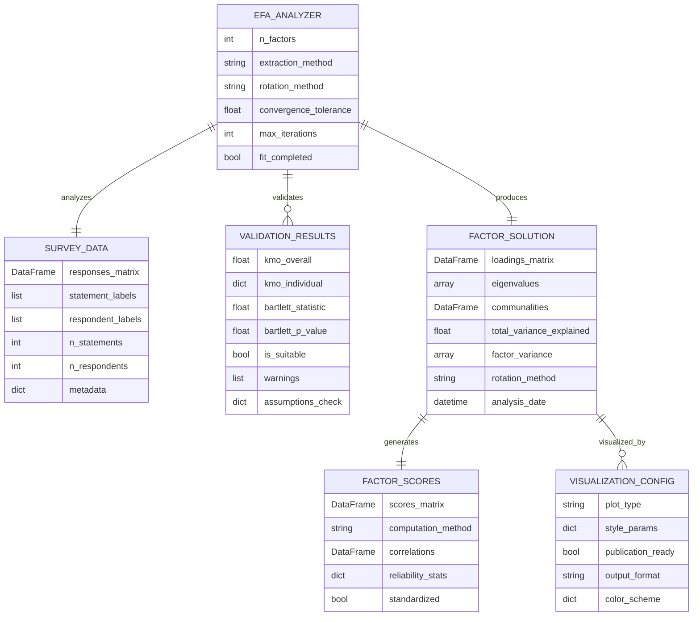

# Data Model: Exploratory Factor Analysis (EFA)

**Feature**: `001-efa-analysis`  
**Created**: November 24, 2025  
**Phase**: 1 (Design & Contracts)

## Entity Relationships



## Core Entities

### 1. EFA_ANALYZER
**Purpose**: Main analysis engine that orchestrates the factor analysis process

**Attributes**:
- `n_factors` (int): Number of factors to extract (None for auto-determination)
- `extraction_method` (str): Factor extraction method ('principal', 'ml', 'minres')
- `rotation_method` (str): Rotation type ('oblimin', 'varimax', 'quartimax')
- `convergence_tolerance` (float): Convergence criterion for iterative methods
- `max_iterations` (int): Maximum iterations for convergence
- `fit_completed` (bool): Whether analysis has been successfully completed

**Relationships**:
- Validates → VALIDATION_RESULTS (1:many)
- Analyzes → SURVEY_DATA (1:1)
- Produces → FACTOR_SOLUTION (1:1)

**Validation Rules**:
- `n_factors` must be ≤ min(n_statements/3, n_respondents-1)
- `extraction_method` must be in ['principal', 'ml', 'minres']
- `rotation_method` must be in ['oblimin', 'varimax', 'quartimax', 'promax']
- Cannot produce FACTOR_SOLUTION without successful validation

### 2. SURVEY_DATA
**Purpose**: Encapsulates the input survey data with metadata

**Attributes**:
- `responses_matrix` (DataFrame): N×M matrix of Likert scale responses
- `statement_labels` (list): Descriptive labels for survey statements
- `respondent_labels` (list): Identifiers for survey respondents
- `n_statements` (int): Number of survey statements (variables)
- `n_respondents` (int): Number of survey respondents (observations)
- `metadata` (dict): Additional survey information (scale type, date collected, etc.)

**Validation Rules**:
- `responses_matrix` must be numeric (int/float)
- Shape consistency: len(statement_labels) == responses_matrix.shape[0]
- Shape consistency: len(respondent_labels) == responses_matrix.shape[1]
- No completely missing rows or columns
- Minimum 3 unique response values per variable

### 3. VALIDATION_RESULTS
**Purpose**: Statistical validation outcomes for factor analysis suitability

**Attributes**:
- `kmo_overall` (float): Overall Kaiser-Meyer-Olkin measure
- `kmo_individual` (dict): KMO values for individual variables
- `bartlett_statistic` (float): Bartlett's sphericity test statistic
- `bartlett_p_value` (float): Bartlett's test p-value
- `is_suitable` (bool): Overall suitability assessment
- `warnings` (list): Warning messages for marginal conditions
- `assumptions_check` (dict): Detailed assumption validation results

**State Transitions**:
- PENDING → COMPLETED (after running validation tests)
- COMPLETED → INVALID (if critical violations detected)

**Validation Rules**:
- `kmo_overall` range: [0.0, 1.0]
- `bartlett_p_value` range: [0.0, 1.0]
- `is_suitable` = True only if kmo_overall ≥ 0.5 AND bartlett_p_value < 0.05
- `warnings` populated if 0.5 ≤ kmo_overall < 0.6

### 4. FACTOR_SOLUTION
**Purpose**: Complete factor analysis results and interpretation data

**Attributes**:
- `loadings_matrix` (DataFrame): Factor loadings with statement labels
- `eigenvalues` (array): Eigenvalues for all extracted factors
- `communalities` (DataFrame): Proportion of variance explained per variable
- `total_variance_explained` (float): Cumulative variance explained by all factors
- `factor_variance` (array): Variance explained by each individual factor
- `rotation_method` (str): Applied rotation method
- `analysis_date` (datetime): Timestamp of analysis completion

**Derived Properties**:
- `significant_loadings`: Loadings with |value| ≥ 0.40
- `simple_structure_index`: Measure of simple structure quality
- `factor_interpretability`: Assessment of factor clarity

**Validation Rules**:
- `loadings_matrix` shape: (n_statements, n_factors)
- `eigenvalues` should be sorted in descending order
- `total_variance_explained` range: [0.0, 1.0]
- Sum of `factor_variance` ≤ `total_variance_explained`

### 5. FACTOR_SCORES
**Purpose**: Individual respondent scores on extracted psychological factors

**Attributes**:
- `scores_matrix` (DataFrame): Factor scores for each respondent
- `computation_method` (str): Method used ('regression', 'bartlett', 'anderson')
- `correlations` (DataFrame): Correlations between factor scores (if oblique rotation)
- `reliability_stats` (dict): Cronbach's alpha and other reliability metrics
- `standardized` (bool): Whether scores are standardized (mean=0, sd=1)

**Validation Rules**:
- `scores_matrix` shape: (n_respondents, n_factors)
- `computation_method` in ['regression', 'bartlett', 'anderson']
- If `rotation_method` == 'varimax': correlations should be near-zero
- `reliability_stats` must include 'cronbach_alpha' for each factor

### 6. VISUALIZATION_CONFIG
**Purpose**: Configuration for factor analysis visualizations

**Attributes**:
- `plot_type` (str): Type of visualization ('scree', 'loadings', 'biplot', 'scores')
- `style_params` (dict): Matplotlib/Seaborn styling parameters
- `publication_ready` (bool): Whether to use publication-quality settings
- `output_format` (str): Output format ('png', 'svg', 'pdf', 'jupyter')
- `color_scheme` (dict): Color mapping for factors and variables

**Validation Rules**:
- `plot_type` in ['scree', 'loadings', 'biplot', 'scores', 'parallel_analysis']
- `output_format` in ['png', 'svg', 'pdf', 'jupyter', 'inline']
- If `publication_ready` == True: DPI ≥ 300, vector format preferred

## Data Flow States

### 1. Input Data State
```
SURVEY_DATA: RAW
├── responses_matrix: loaded from soc_opros_loader
├── statement_labels: extracted from data
├── respondent_labels: extracted from data
└── metadata: collected from source
```

### 2. Validation State
```
VALIDATION_RESULTS: COMPUTED
├── kmo_overall: calculated from correlation matrix
├── bartlett_statistic: sphericity test result
├── is_suitable: boolean assessment
└── warnings: conditional messages
```

### 3. Analysis State
```
FACTOR_SOLUTION: EXTRACTED
├── loadings_matrix: rotated factor loadings
├── eigenvalues: from correlation matrix decomposition
├── communalities: sum of squared loadings
└── factor_variance: from eigenvalue decomposition
```

### 4. Output State
```
FACTOR_SCORES: COMPUTED
├── scores_matrix: individual factor positions
├── reliability_stats: internal consistency measures
└── correlations: factor intercorrelations (if oblique)
```

## Schema Validation Rules

### Data Type Constraints
```python
VALIDATION_SCHEMA = {
    'EFA_ANALYZER': {
        'n_factors': {'type': [int, type(None)], 'range': (1, None)},
        'extraction_method': {'type': str, 'enum': ['principal', 'ml', 'minres']},
        'rotation_method': {'type': str, 'enum': ['oblimin', 'varimax', 'quartimax']},
        'convergence_tolerance': {'type': float, 'range': (1e-6, 1e-2)},
        'max_iterations': {'type': int, 'range': (10, 1000)}
    },
    'SURVEY_DATA': {
        'responses_matrix': {'type': 'DataFrame', 'dtype': ['int64', 'float64']},
        'statement_labels': {'type': list, 'element_type': str},
        'respondent_labels': {'type': list, 'element_type': str},
        'n_statements': {'type': int, 'range': (3, None)},
        'n_respondents': {'type': int, 'range': (3, None)}
    }
}
```

### Business Logic Constraints
```python
BUSINESS_RULES = {
    'sample_size_ratio': {
        'rule': 'n_respondents >= 3 * n_statements',
        'warning_threshold': 'n_respondents >= 5 * n_statements',
        'message': 'Sample size may be inadequate for reliable factor analysis'
    },
    'factor_count_limit': {
        'rule': 'n_factors <= min(n_statements/3, n_respondents-1)',
        'error_message': 'Too many factors for available data'
    },
    'loading_significance': {
        'rule': 'abs(loading) >= 0.40',
        'interpretation': 'Practically significant factor loading'
    }
}
```

## Error Handling Strategy

### Validation Errors
- **CRITICAL**: Analysis cannot proceed (insufficient data, singular matrix)
- **WARNING**: Analysis can proceed with caution (low KMO, small sample)
- **INFO**: Suboptimal but acceptable conditions (marginal reliability)

### Recovery Patterns
```python
def handle_validation_failure(error_type, data, config):
    if error_type == 'INSUFFICIENT_SAMPLE':
        # Suggest data transposition or factor reduction
        return suggest_data_orientation_fix(data)
    elif error_type == 'LOW_KMO':
        # Warn but allow continuation with educational disclaimer
        return create_warning_message(kmo_value, threshold=0.6)
    elif error_type == 'SINGULAR_MATRIX':
        # Suggest removing perfectly correlated variables
        return identify_multicollinearity_issues(data)
```

## Performance Considerations

### Memory Usage
- **Input Data**: O(n_statements × n_respondents)
- **Correlation Matrix**: O(n_statements²)
- **Factor Solution**: O(n_statements × n_factors)
- **Estimated Peak**: ~3x input data size for intermediate calculations

### Computational Complexity
- **Correlation Matrix**: O(n_statements² × n_respondents)
- **Eigenvalue Decomposition**: O(n_statements³)
- **Factor Rotation**: O(n_statements × n_factors × iterations)
- **Overall**: O(n_statements³) for typical cases

### Scalability Limits
- **Comfortable**: ≤ 500 statements, ≤ 100 respondents
- **Maximum**: ≤ 1000 statements, ≤ 200 respondents
- **Memory**: ~8GB RAM recommended for maximum scale

## Integration Points

### With Existing Systems
```python
# Integration with soc_opros_loader
from soc_opros_loader import SocOprosLoader
loader = SocOprosLoader()
raw_data = loader.get_responses_matrix()

# Convert to SURVEY_DATA entity
survey_data = SurveyData.from_loader(loader)
```

### Export Interfaces
```python
# Export to common analysis formats
factor_solution.to_spss()      # SPSS syntax file
factor_solution.to_r()         # R data frame
factor_solution.to_excel()     # Excel workbook with multiple sheets
factor_solution.to_json()      # JSON for web applications
```

## Future Extensions

### Planned Enhancements
- **Confirmatory Factor Analysis**: CFA capabilities for model testing
- **Multi-group Analysis**: Factor invariance testing across groups
- **Parallel Analysis**: Monte Carlo simulation for factor number determination
- **Robust Methods**: Handling of non-normal and outlier-prone data

### API Compatibility
- Current design supports extension to CFA without breaking changes
- Visualization system designed for additional plot types
- Data model accommodates multi-group and longitudinal extensions